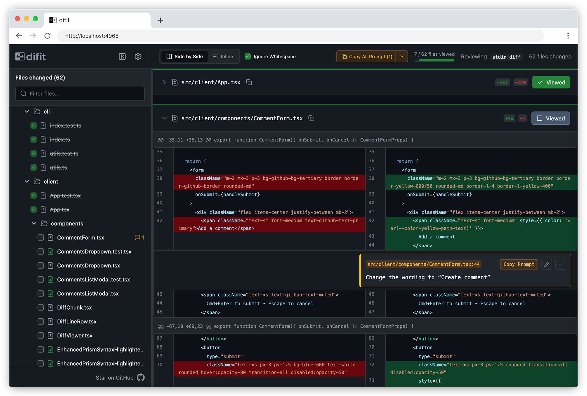

<h1 align="center">
  
</h1>

<p align="center">
  <a href="./README.md">English</a> | <a href="./README.ja.md">日本語</a> | <a href="./README.zh.md">简体中文</a> | 한국어
</p>



**difit**은 GitHub 스타일 뷰어로 로컬 git diff를 보고 검토할 수 있는 CLI 도구입니다. 깔끔한 시각적 효과와 함께 코멘트를 AI용 프롬프트로 복사할 수 있습니다. AI 시대의 로컬 코드 리뷰 도구!

## ⚡ 빠른 시작

먼저 시도해 보세요

```bash
npx difit  # WebUI에서 최신 커밋 diff 보기
```

설치하여 사용

```bash
npm install -g difit
difit  # WebUI에서 최신 커밋 diff 보기
```

AI 에이전트에서 사용할 수 있도록 설정

```bash
npx skills add yoshiko-pg/difit # 에이전트에 Skill 추가
```

## 🚀 사용법

### 기본 사용법

```bash
difit <target>                    # 단일 커밋 diff 보기
difit <target> [compare-with]     # 두 커밋/브랜치 비교
```

### 단일 커밋 검토

```bash
difit          # HEAD (최신) 커밋
difit 6f4a9b7  # 특정 커밋
difit feature  # feature 브랜치의 최신 커밋
```

### 두 커밋 비교

```bash
difit @ main         # main 브랜치와 비교 (@는 HEAD의 별칭)
difit feature main   # 브랜치 간 비교
difit . origin/main  # 작업 디렉토리와 원격 main 비교
```

### 특수 인수

difit은 일반적인 diff 시나리오를 위한 특수 키워드를 지원합니다:

```bash
difit .        # 모든 커밋되지 않은 변경 사항 (스테이징 영역 + 미스테이징)
difit staged   # 스테이징 영역 변경 사항
difit working  # 미스테이징 변경 사항만
```

### GitHub PR

```bash
difit --pr https://github.com/owner/repo/pull/123
```

`--pr` 모드는 내부적으로 `gh pr diff --patch`를 실행해 패치를 가져옵니다.

인증은 GitHub CLI가 처리합니다:

1. **한 번 로그인** (권장): `gh auth login`
2. **토큰 인증** (CI/비대화형 환경): `GH_TOKEN` 또는 `GITHUB_TOKEN` 설정

#### GitHub Enterprise Server

Enterprise Server PR의 경우 GitHub CLI를 Enterprise 호스트에 인증하세요:

1. `gh auth login --hostname YOUR-ENTERPRISE-SERVER`
2. 또는 `GH_HOST=YOUR-ENTERPRISE-SERVER`와 `GH_TOKEN`/`GITHUB_TOKEN` 설정

### 표준 입력

파이프를 사용하여 표준 입력을 통해 통합 diff를 전달하면 모든 도구의 diff를 difit으로 볼 수 있습니다.

```bash
# 다른 도구의 diff 보기
diff -u file1.txt file2.txt | difit

# 저장된 패치 검토
cat changes.patch | difit

# 머지 베이스와 비교
git diff --merge-base main feature | difit

# 기존 파일 전체를 신규 추가처럼 검토
git diff -- /dev/null path/to/file | difit

# 명시적 표준 입력 모드
git diff --cached | difit -
```

표준 입력 모드는 의도 우선 규칙으로 선택됩니다:

- `-`를 지정하면 표준 입력 모드가 명시적으로 활성화됩니다
- positional 인수(`<target>` / `[compare-with]`), `--pr`, `--tui` 중 하나라도 지정되면 Git/PR/TUI 모드로 처리하고 stdin 자동 읽기를 하지 않습니다
- 명시적 모드 지정이 없고 stdin이 pipe/file/socket 인 경우에만 자동으로 표준 입력 모드가 됩니다

## ⚙️ CLI 옵션

| 플래그                | 기본값    | 설명                                                              |
| --------------------- | --------- | ----------------------------------------------------------------- |
| `<target>`            | HEAD      | 커밋 해시, 태그, HEAD~n, 브랜치 또는 특수 인수                    |
| `[compare-with]`      | -         | 비교할 선택적 두 번째 커밋 (둘 사이의 diff 표시)                  |
| `--pr <url>`          | -         | 검토할 GitHub PR URL (예: https://github.com/owner/repo/pull/123) |
| `--port`              | 4966      | 선호 포트; 사용 중인 경우 +1로 대체                               |
| `--host`              | 127.0.0.1 | 서버를 바인딩할 호스트 주소 (외부 액세스는 0.0.0.0 사용)          |
| `--no-open`           | false     | 브라우저를 자동으로 열지 않음                                     |
| `--mode`              | split     | 표시 모드: `unified` 또는 `split`                                 |
| `--tui`               | false     | WebUI 대신 터미널 UI 모드 사용                                    |
| `--clean`             | false     | 시작 시 모든 기존 코멘트와 열람된 파일 표시 초기화                |
| `--include-untracked` | false     | diff에 untracked 파일 자동 포함 (`.` 또는 `working`에서만 유효)   |
| `--keep-alive`        | false     | 브라우저 연결이 끊겨도 서버 유지 (Ctrl+C로 수동 종료)             |

## 💬 코멘트 시스템

difit은 AI 코딩 에이전트에 피드백을 쉽게 제공할 수 있는 리뷰 코멘트 시스템을 포함합니다:

1. **코멘트 추가**: diff 줄의 코멘트 버튼을 클릭하거나 드래그하여 범위 선택
2. **코멘트 편집**: 편집 버튼으로 기존 코멘트 편집
3. **프롬프트 생성**: 코멘트에는 AI 코딩 에이전트용 컨텍스트를 포맷하는 "프롬프트 복사" 버튼 포함
4. **모두 복사**: "모든 프롬프트 복사"를 사용하여 구조화된 형식으로 모든 코멘트 복사
5. **영구 저장**: 코멘트는 커밋별로 브라우저 localStorage에 저장

### 코멘트 프롬프트 형식

```sh
src/components/Button.tsx:L42   # 이 줄은 자동으로 추가됩니다
이 변수 이름을 더 설명적으로 만드세요
```

범위 선택의 경우:

```sh
src/components/Button.tsx:L42-L48   # 이 줄은 자동으로 추가됩니다
이 부분은 불필요합니다
```

## 🤖 에이전트에서 호출

difit을 사용해 사용자에게 리뷰를 요청하는 Skill은 아래 명령으로 설치할 수 있습니다:

```sh
npx skills add yoshiko-pg/difit
```

에이전트가 코드를 수정한 뒤에는 difit 서버를 실행합니다.

## 🎨 구문 강조 언어

- **JavaScript/TypeScript**: `.js`, `.jsx`, `.ts`, `.tsx`
- **웹 기술**: HTML, CSS, JSON, XML, Markdown
- **셸 스크립트**: `.sh`, `.bash`, `.zsh`, `.fish`
- **백엔드 언어**: PHP, SQL, Ruby, Java, Scala, Perl
- **시스템 언어**: C, C++, C#, Rust, Go
- **모바일 언어**: Swift, Kotlin, Dart
- **인프라 코드**: Terraform (HCL)
- **기타**: Python, Protobuf, YAML, Solidity, Vim 스크립트

## 🔍 자동 접힘 파일

difit은 특정 파일을 자동으로 식별하고 접어서 뷰를 깔끔하게 유지합니다:

- **삭제된 파일**: 삭제된 파일은 자세한 검토가 필요하지 않으므로 자동으로 접힙니다
- **자동 생성 파일**: 자동 생성된 코드는 기본적으로 접힙니다. 여기에는 다음이 포함됩니다:
  - 잠금 파일 (`package-lock.json`, `go.mod`, `Cargo.lock`, `Gemfile.lock` 등)
  - 축소된 파일 (`*.min.js`, `*.min.css`)
  - 소스 맵 (`*.map`)
  - 생성된 코드:
    - Orval (`*.msw.ts`, `*.zod.ts`, `*.api.ts`)
    - Dart (`*.g.dart`, `*.freezed.dart`)
    - C# (`*.g.cs`, `*.designer.cs`)
    - Protobuf (`*.pb.go`, `*.pb.cc`, `*.pb.h`)
  - 프레임워크:
    - Ruby on Rails (`db/schema.rb`)
    - Laravel (`_ide_helper.php`)
    - Gradle (`gradle.lockfile`)
    - Python (`uv.lock`, `pdm.lock`)
  - 일반적인 생성 파일 (`*.generated.cs`, `*.generated.ts`, `*.generated.js`)
  - 콘텐츠 기반 감지:
    - `@generated` 마커가 포함된 파일
    - `DO NOT EDIT` 헤더가 포함된 파일
    - 언어별 생성 헤더 (Go, Python 등)

## 🛠️ 개발

```bash
# 의존성 설치
pnpm install

# 개발 서버 시작 (핫 리로드 포함)
# Vite 개발 서버와 CLI를 NODE_ENV=development로 동시에 실행
pnpm run dev

# 프로덕션 서버 빌드 및 시작
pnpm run start <target>

# 프로덕션용 빌드
pnpm run build

# 테스트 실행
pnpm test

# 타입체크와 lint와 포맷
pnpm run check
pnpm run format
```

### 개발 워크플로우

- **`pnpm run dev`**: Vite 개발 서버 (핫 리로드 포함)와 CLI 서버를 동시에 시작
- **`pnpm run start <target>`**: 모든 것을 빌드하고 프로덕션 서버 시작 (최종 빌드 테스트용)
- **개발 모드**: 핫 리로드와 빠른 개발을 위해 Vite의 개발 서버 사용
- **프로덕션 모드**: 빌드된 정적 파일 제공 (npx 및 프로덕션 빌드에서 사용)

## 🏗️ 아키텍처

- **CLI**: 포괄적인 검증을 갖춘 Commander.js로 인수 구문 분석
- **백엔드**: diff 처리를 위한 simple-git이 포함된 Express 서버
- **GitHub 통합**: GitHub CLI(`gh pr diff --patch`) 기반 PR 패치 조회
- **프론트엔드**: React 18 + TypeScript + Vite
- **스타일링**: GitHub과 유사한 다크 테마를 갖춘 Tailwind CSS v4
- **구문 강조**: 동적 언어 로딩을 갖춘 Prism.js
- **테스트**: 동일 위치에 배치된 테스트 파일을 사용하는 Vitest 단위 테스트
- **품질**: oxlint, oxfmt, lefthook 사전 커밋 훅

## 📋 요구 사항

- Node.js ≥ 21.0.0
- 검토할 커밋이 포함된 Git 저장소
- `--pr` 모드 사용 시 GitHub CLI(`gh`)

## 📄 라이선스

MIT
